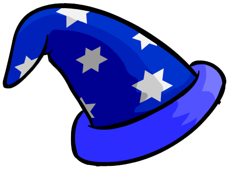

### Writing a DSL for the Dense

<div style="color:gray">Nathan Perdijk (@nrbperdijk)</div>
<div style="color:gray">Jan-Hendrik Kuperus (@jhkuperus)</div>

---

<!-- .slide: data-transition="none" -->
### Slide 1 ^_^

* <!-- .element: class="fragment" --> Bullet 1
* <!-- .element: class="fragment" --> Bullet 2

---

<!-- .slide: data-transition="none" -->
### Who is Jan-Hendrik Kuperus

<div style="position: absolute; left: 5%; top: 30%; width: 20%;">
  
</div>

<ul>
<li>Java Programmer</li>
<li class="no-bullet">&nbsp;</li>
<li class="no-bullet">&nbsp;</li>
<li class="no-bullet">&nbsp;</li>
<li class="no-bullet">&nbsp;</li>
</ul>

<div style="height: 40px">&nbsp;</div>
<div class="company-logo placeholder"></div>

---

<!-- .slide: data-transition="none" -->
### Who is Jan-Hendrik Kuperus

<div style="position: absolute; left: 5%; top: 30%; width: 20%;">
  
</div>

<ul>
<li><span class="strike">Java</span>Scala Programmer</li>
<li class="no-bullet">&nbsp;</li>
<li class="no-bullet">&nbsp;</li>
<li class="no-bullet">&nbsp;</li>
<li class="no-bullet">&nbsp;</li>
</ul>

<div style="height: 40px">&nbsp;</div>
<div class="company-logo placeholder"></div>

---

<!-- .slide: data-transition="none" -->
### Who is Jan-Hendrik Kuperus

<div style="position: absolute; left: 5%; top: 30%; width: 20%;">
  
</div>

<ul>
<li class="strike">JavaScala Programmer</li>
<li>Software Developer</li>
<li class="no-bullet">&nbsp;</li>
<li class="no-bullet">&nbsp;</li>
<li class="no-bullet">&nbsp;</li>
</ul>

<div style="height: 40px">&nbsp;</div>
<div class="company-logo placeholder"></div>

---

<!-- .slide: data-transition="none" -->
### Who is Jan-Hendrik Kuperus

<div style="position: absolute; left: 5%; top: 30%; width: 20%;">
  
</div>

<ul>
<li class="strike">JavaScala Programmer</li>
<li class="strike">Software Developer</li>
<li>Consultant</li>
<li class="no-bullet">&nbsp;</li>
<li class="no-bullet">&nbsp;</li>
</ul>

<div style="height: 40px">&nbsp;</div>
<div class="company-logo placeholder"></div>

---

<!-- .slide: data-transition="none" -->
### Who is Jan-Hendrik Kuperus

<div style="position: absolute; left: 5%; top: 30%; width: 20%;">
  
</div>

<ul>
<li class="strike">JavaScala Programmer</li>
<li class="strike">Software Developer</li>
<li class="strike">Consultant</li>
<li class="">Principal Engineer</li>
<li class="no-bullet">&nbsp;</li>
</ul>

<div style="height: 40px">&nbsp;</div>
<div class="company-logo placeholder"></div>

---

<!-- .slide: data-transition="none" -->
### Who is Jan-Hendrik Kuperus

<div style="position: absolute; left: 5%; top: 30%; width: 20%;">
  
  
</div>

<ul>
<li class="strike">JavaScala Programmer</li>
<li class="strike">Software Developer</li>
<li class="strike">Consultant</li>
<li class="strike">Principal Engineer</li>
<li class="">Grand Coding Wizard</li>
</ul>

<div style="height: 40px">&nbsp;</div>

<div class="company-logo placeholder"></div>

---

<!-- .slide: data-transition="none" data-autoslide="800" -->
### Who is Jan-Hendrik Kuperus

<div style="position: absolute; left: 5%; top: 30%; width: 20%;">
  
  
</div>

<ul>
<li class="strike">JavaScala Programmer</li>
<li class="strike">Software Developer</li>
<li class="strike">Consultant</li>
<li class="strike">Principal Engineer</li>
<li class="">Event Sourcerer</li>
</ul>

<div style="height: 40px">&nbsp;</div>

<div style="left: -3.5%" class="company-logo"><div class="fragment" data-autoslide="800" style="background-image: url(assets/aon-embleem.png);"></div></div>
<div style="left: 12%"   class="company-logo"><div class="fragment" data-autoslide="800" style="background-image: url(assets/tnt-embleem.png);"></div></div>
<div style="left: 27.5%" class="company-logo"><div class="fragment" data-autoslide="800" style="background-image: url(assets/prorail-embleem.png);"></div></div>
<div style="left: 43%"   class="company-logo"><div class="fragment" data-autoslide="800" style="background-image: url(assets/belastingdienst-embleem.jpeg);"></div></div>
<div style="left: 58.5%" class="company-logo"><div class="fragment" data-autoslide="800" style="background-image: url(assets/klm-embleem.png);"></div></div>
<div style="left: 74%"   class="company-logo"><div class="fragment" data-autoslide="800" style="background-image: url(assets/rabobank-embleem.png);"></div></div>
<div style="left: 89.5%" class="company-logo"><div class="fragment" data-autoslide="0" style="background-image: url(assets/politie-embleem.png);"></div></div>

<div class="fragment" style="position: absolute; left: 80%; top: 30%; width: 10%;" data-autoslide="off">
	
</div>

---

### What is a DSL ?

* Formal definition ?
* My Definition: altering how public API should be called purely to increase the ease of use or aesthetics of the library

---

### Purposes of a DSL

* Abstract dificult initialisation logic away
* Increase readability of code
* Guide people less familiar with the code through the API
* Increase 'configurability' of a library

---

### Wolf, Sheep and Cabbage

* Participants: Wolf, Sheep, Cabbage
* Activities: Enter boat, Cross the stream, Exit boat
* Outcomes: Participant eaten, No eating at all

---

### The Code for the Problem

---

### The DSL for the problem

```
Sheep enters the boat
The boat crosses the stream

Sheep exits the boat
The boat crosses the stream

etc...
```

---

### Anatomy of the DSL

---

### Real Life Event Sourcing with Axon Framework

<div style="position: absolute; left: 5%; top:22%; width: 20%;">
  
</div>

<ul class="no-bullet">
<li>&nbsp;</li>
<li>jhkuperus@yoink.nl</li>
<li>@jhkuperus</li>
<li>&nbsp;</li>
<li>&nbsp;</li>
<li>&nbsp;</li>
<li><a href="http://axonframework.org/">www.axonframework.org</a></li>
</ul>

<div style="position: absolute; left: 80%; top: 73%; width: 182px; height: 182px;">
	<div style="border: 2px solid #ccc; width: 182px; height: 182px; border-radius: 50%; background: white url(assets/axon-logo.jpg) no-repeat center; background-size: 80%; overflow: hidden;">&nbsp;</div>
</div>

